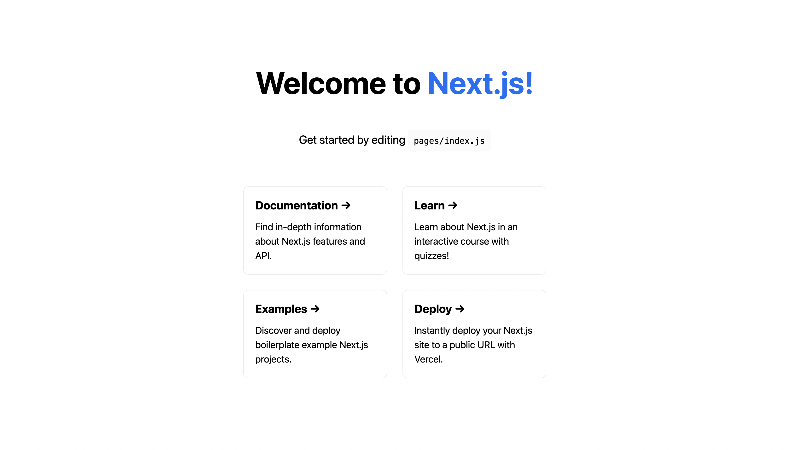
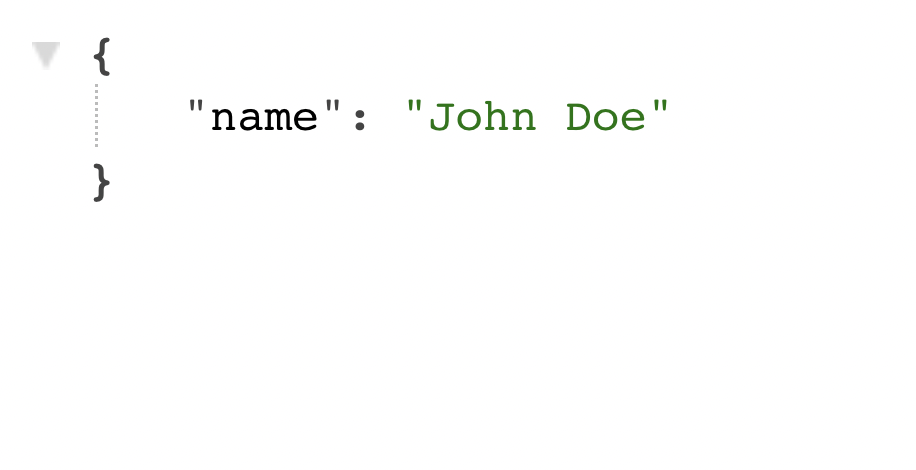
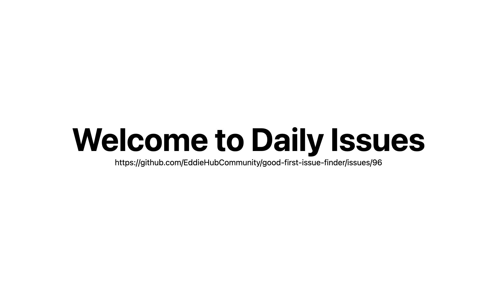
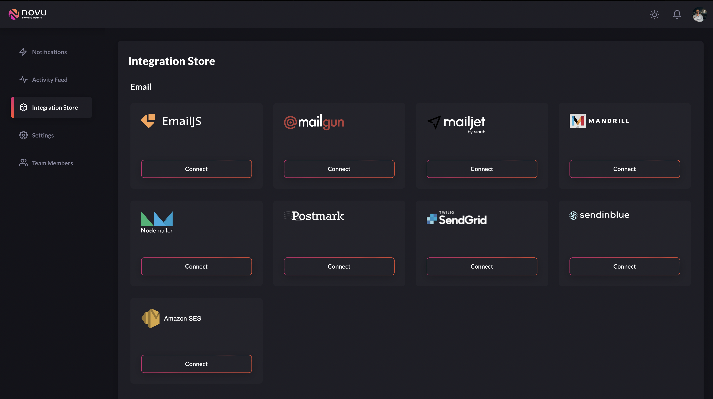
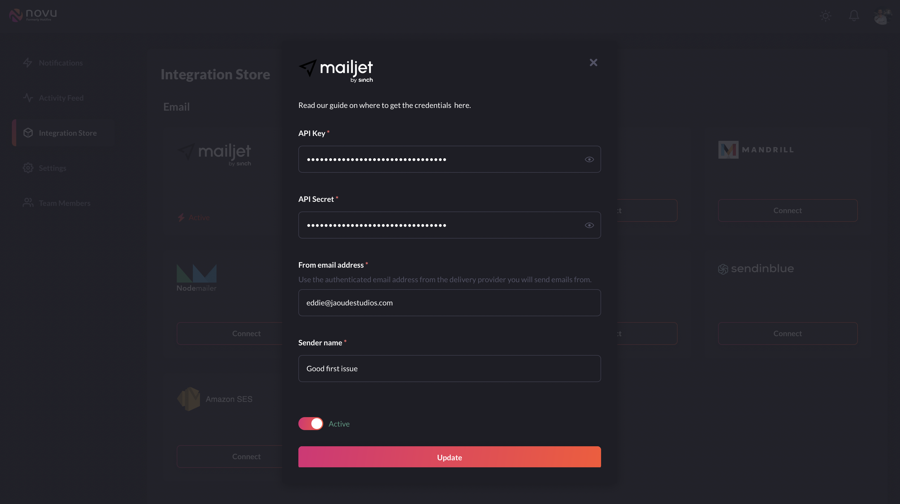
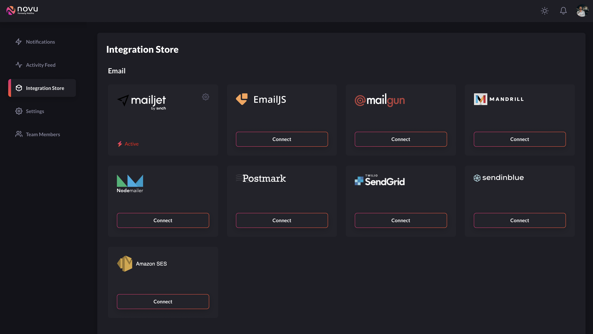
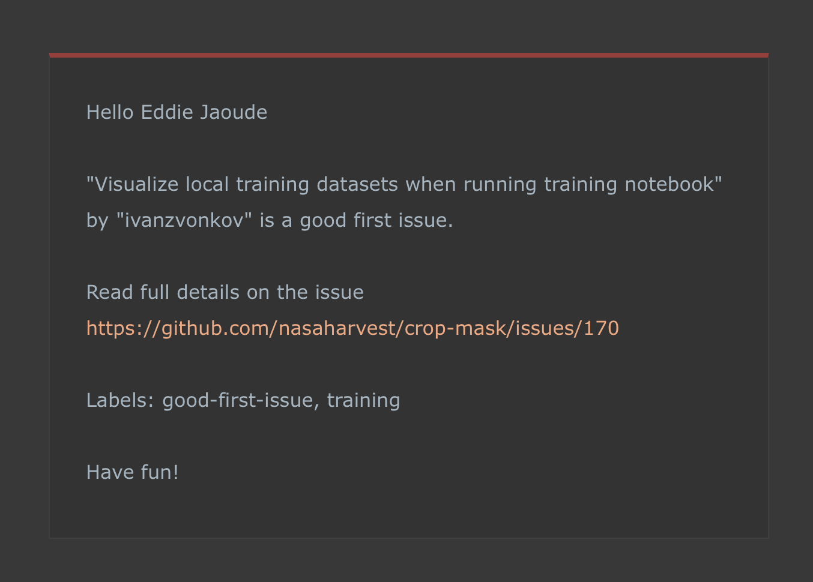

### Tutorial

In this video we are going to build a fullstack app that reads a random good first issue from GitHub's API and sends it to you daily via email or sms - we will also display it in the browser.

We will be using NextJS to build the project, which is a React framework that also comes with an API. This will allow us to rapidly build our app and we will also use Novu, the open source notification platform that helps us switch different email providers to sms providers, templates and more.

Let's get coding...

With 1 command we can create a NextJS project using the npx

```bash
npx create-next-app@latest daily-issues
```

I always highly recommend checking it is working at each step of the journey. We can do this by running the app

```bash
cd daily-issues
npm run dev
```

Go to http://localhost:3000 in the browser and you will see the standard NextJS web page.



Then visit http://localhost:3000/api/hello and you also should see the standard NextJS example data API.



When buiding my apps, I like to start with some hardcoded data in the API and have it displayed in the UI. Then when we get the real data from a database or in this case from GitHub's API, it will all still work accordingly. Let me show you. 

Create a directory called `issues` in the `api` directory, and add the file `index.js` (the path of the file will be `pages/api/issues/index.js`. This file path will result in the API path being http://localhost:3000/api/issues

The contents of the file will be...

```js
export default function handler(req, res) {
  const issue = {
     name: "Issue title",
     author: "eddiejaoude",
     labels: [
          "🏁 status: ready for dev",
          "⭐ goal: addition",
          "🔢 points: 1",
          "🟨 priority: medium",
          "good first issue"
       ],
     url: "https://github.com/EddieHubCommunity/good-first-issue-finder/issues/96"
  };

  res.status(200).json(issue);
}
```

For NextJS to do the heavy lifting, we need to export a default function with the name `handler`, where this function will get the request and response objects injected in (we will cover these in more detail and the use cases in a bit). We create a hardcoded constant `issue` for a temporary solution to see the data being read from the API and displayed in the UI. Then the data is returned in json format with a status code of `200` which means successful.

Now if you visit http://localhost:3000/api/issues you should see the json in the browser. With this data now available on our API, we want to call it from our React frontend.

Open file `pages/index.js`, you can delete most of it, if not all of the example code in the `main` html tag and `footer` tag. You should be left with something like this...

```html
<main className={styles.main}>
   <h1 className={styles.title}>Welcome to Daily Issues</h1>
</main>

<footer className={styles.footer}>Powered by Open Source</footer>
```

To fetch the data in the frontend from the API NextJS has a few ways to render your content in different situations, depending on your application's use case. These include pre-rendering with Server-side rendering or static generation. With updating or creating content at runtime with incremental static regeneration and client side data fetching with useEffect. Learn more in the official docs on [Data Fetching](https://nextjs.org/docs/basic-features/data-fetching/overview)

Above the `Home` function, create a new function with the name `getServerSideProps` to call the API and pass the data to our `Home` function. This new function will look like...

```js
export async function getServerSideProps() {
  const res = await fetch(`http://localhost:3000/api/issues`);
  const data = await res.json();

  return { props: { data } };
}
```

Then we can now add `data` to the parameter of the `Home` component `Home({ data })` and use the data variable in the html.

```html
<main className={styles.main}>
   <h1 className={styles.title}>Welcome to Daily Issues</h1>

   {data.url}
</main>
```

With the complete file looking like...

```js
import Head from "next/head";
import styles from "../styles/Home.module.css";

export async function getServerSideProps() {
  const res = await fetch(`http://localhost:3000/api/issues`);
  const data = await res.json();

  return { props: { data } };
}

export default function Home({ data }) {
  return (
    <div className={styles.container}>
      <Head>
        <title>Daily Issues</title>
        <meta name="description" content="Generated by create next app" />
        <link rel="icon" href="/favicon.ico" />
      </Head>

      <main className={styles.main}>
        <h1 className={styles.title}>Welcome to Daily Issues</h1>

        {data.url}
      </main>

      <footer className={styles.footer}>Powered by Open Source</footer>
    </div>
  );
}
```

The resulting web page on http://localhost:3000 will now look something like this...



Now we have some of the data from the hardcoded API data being displayed in the UI. Let's make it real dynamic from GitHub's API using the library `octokit`.

```bash
npm install octokit
```

In the `pages/api/issues/index.js` we import the `octokit` library...

```js
import { Octokit } from "octokit";
```

We can now use it to query the GitHub API, but first we must create an instance of `octokit` with the code `new Octokit()`, then we can create a request to search GitHub's API.

```js
const octokit = new Octokit();
const q = "is:open is:issue label:good-first-issue";

const response = await octokit.request("GET /search/issues", { q });
```

This query will get us a collection of issues with many fields. We can map the data to only return the fields we are interested in...

```js
const results = response.data.items.map((item) => ({
   name: item.title,
   author: item.user.login,
   labels: item.labels.map((label) => label.name),
   url: item.html_url,
}));
```

Instead of returning the hardcoded constant `issue`, we can randomly select 1 real issue from the collection to return, using...

```js
const random = Math.floor(Math.random() * (results.length + 1));

res.status(200).json(results[random]);
```

The complete file will look like...

```js
import { Octokit } from "octokit";

export default async function handler(req, res) {
  const octokit = new Octokit();
  const q = "is:open is:issue label:good-first-issue";

  const response = await octokit.request("GET /search/issues", {
    q,
  });

  const results = response.data.items.map((item) => ({
    name: item.title,
    author: item.user.login,
    labels: item.labels.map((label) => label.name),
    url: item.html_url,
  }));

  const random = Math.floor(Math.random() * (results.length + 1));

  res.status(200).json(results[random]);
}
```

Now we have real data from GitHub, we can use it in our React frontend.

So that in addition to the url, we can see the issue name, and the author, with all the issue labels, by replacing `{data.url}` with the following...

```html
<p>
    {data.title} ({data.author})
</p>
<p>{data.labels.join(", ")}</p>
<p>{data.url}</p>
```

Let's create some data files that we can load to send people their daily "good first issue" issue. Create the directory in the root of the project called `data`, and add a `json` file with the contents (I recommend naming them with your github username)...

File: `data/eddiejaoude.json`
```json
{
  "name": "Eddie Jaoude",
  "email": "eddie@jaoudestudios.com"
}
```

We will need to read the `data` directory and the contents of each file, we will use the node core library `fs` and `path`, let's import these at the top of the file...

```js
import fs from "fs";
import path from "path";
```

As we don't always want to send the notification, for example when we are displaying an issue in the UI, we can check the query param for the `send` query param, if it is set to `true` we will send the email. We will get the `send` query param at the top of the `handler` function with the following code...

```js
const { send } = req.query;
```

After the issue is fetched from the GitHub API and we select a random issue, then we can get the user information and send the email.

With `fs.readdirSync` we can read the contents of the `data` directory and with `fs.readFileSync` we can read the contents of the file, but as there will be multiple files we will `map` over each file and read the contents...

```js
if (send) {
    const files = fs.readdirSync(path.resolve("data"));
    const users = files.map((file) => ({
      ...JSON.parse(fs.readFileSync(path.resolve("data", file), "utf8")),
      file,
    }));
```

For each user we will create a new email notification, this can be achieved with a few lines of code using the Novu notificaton platform. 

Firstly let's create an account on Novu https://web.novu.co, I logged in with my GitHub, they only request the minimum infornation which is your public Github data.

Then we need to integrate the email service with the Novu platform. You can use any that are supported, such as SendGrid, Mailgun, Amazon SES. Either way the process is the same.

At this time here are the supported providers...



Click on `Connect` for the provider you wish to integrate with. In my case I am using Mailjet and I fill in the private keys provided by Mailjet.



After submitting the form, you will see on the integration page that now we have 1 integration. You can add more as you require.



Go back to the Notifictions page and we need to create a `Template` for the email. Fill out the following

- `Notification Name` for `This is will be used to identify the notification in the app`
- `Notification Group` for `Categorize notifications into groups for unified settings control`
- `Notification Description` for `Write an internal description of when and how this notification will be used.`

Then add `Add a Channel`, I will select `Email`. Here you can choose one or multiples as you wish. Enter a subject line and body for the email. With the body it is possible to use their editor or write your own custom code. I will use their editor and add my email body with the variables I want to pass from the code. 

```
Hello {{name}}

"{{title}}" by "{{author}}" is a good first issue.

Read full details on the issue {{url}}

Labels: {{labels}}

Have fun!
```

In this situation: name, title, author, url, labels are all going to be sent to the email from our code but the email template itself is not in the code, so this allows us to make changes easily without redeploying the code. However, if you prefer to have it in your code then that is possible too.


Import the Novu library with the following...

```js
import { Novu } from "@novu/node";
```

Create the Novu object with the private token. I have put the private token in an environment variable called `NOVU_TOKEN`, so it does not get committed by mistake and we can read this out of the environment variable ...

```js
const novu = new Novu(process.env.NOVU_TOKEN);
```

We can set the environment variable in the file `.env.local` and NextJS will automatically load it when the app is running and also it is already in the gitignore file, therefore it will not be committed by accident.

```
NOVU_TOKEN=<your-private-novu-token>
```

Now that the Novu object is ready to be used, we can create a new notification. We will use the `forEach` function to loop through each user. 

The email trigger needs the notification name for the first parameter then the 2nd parameter is an object that will contain the required fields: 
- **`to`** - Will contain the recipient information, it can either be an object or an array of objects. Which will contain the `subscriberId` and the `email` or `phone` credentials.
- **`payload`** - Any additional parameters we want to use in the template on the Novu platform.

```js
users.forEach((user) => {
    novu.trigger("good-first-issue", {
        to: {
          subscriberId: user.email,
          email: user.email,
        },
        payload: {
          name: user.name,
          title: issue.title,
          author: issue.author,
          labels: issue.labels.join(", "),
          url: issue.url,
        }
    });
});
```

If you visit the UI on http://localhost:3000 or the API on http://localhost:3000/issues nothing will have changed, but if you visit the API on http://localhost:3000/api/issues?send=true, then the email will be sent to the users. 

The email will look like this...



To conclude, having notifications in your app which are emails or sms does not have to be complicated and can be integrated with only a few clicks and a few lines of code with Novu. In addition, having Novu take care of the heavy lifting of sending the notification, if you ever want to switch providers, that is as straightforward as a few simple steps, no code changes needed.

If you are following along, here are a few ideas to inspire you...

- Cronjob to trigger the email at a certain time
- GitHub Action to trigger the email at a certain time

What ideas do you have? Leave a comment below
